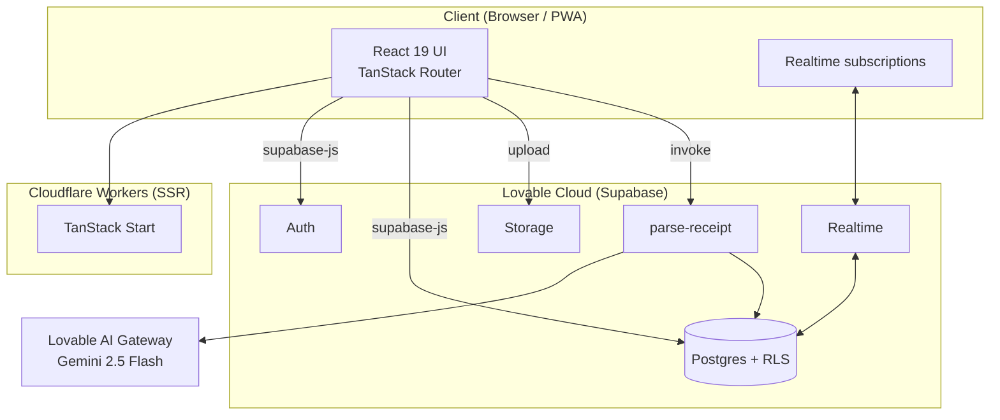

# SeatSolo

Split a restaurant bill in seconds. The host scans the receipt, guests join with a 6-character code, and everyone claims the items they ordered. Tax and tip are split proportionally.

Live: [seatsolo.app](https://seatsolo.app)

## Features

- **Receipt OCR** — Snap or upload a photo; items, fees, and tax are parsed automatically.
- **Live sessions** — Guests join via a short code or share link; updates sync in realtime.
- **Per-item claiming** — Items split evenly across everyone who claims them.
- **Smart totals** — Tax and tip distributed proportionally to each guest's subtotal.
- **Host dashboard** — Inline edit, delete, claim leftovers, native share, sticky "your share" bar.
- **Quality of life** — Auto-submit join codes, haptic feedback, loading skeletons, remembered tip %.

## Tech stack

- **Frontend** — React 19 + TanStack Router + TanStack Start (Vite 7)
- **Styling** — Tailwind CSS v4 + shadcn/ui
- **Backend** — Lovable Cloud (Supabase: Postgres, Auth, Realtime, Storage)
- **OCR** — Supabase edge function `parse-receipt` calling Lovable AI Gateway (Gemini 2.5 Flash vision)
- **Hosting** — Cloudflare Workers (SSR)

## Getting started

```bash
bun install
bun run dev
```

Environment variables (`.env`) are auto-managed by Lovable Cloud:

- `VITE_SUPABASE_URL`
- `VITE_SUPABASE_PUBLISHABLE_KEY`
- `VITE_SUPABASE_PROJECT_ID`

## Project structure

```
src/
  routes/                  TanStack file-based routes
    index.tsx              Landing + join code
    host.dashboard.tsx     Host live view
    host.history.tsx       Past bills
    join.$code.tsx         Guest deep-link entry
    session.$code.claim.tsx  Guest claim screen
    session.$code.me.tsx     Guest summary + paid
  components/ui/           shadcn primitives
  integrations/supabase/   Auto-generated client + types
supabase/
  functions/parse-receipt/ Receipt OCR edge function
docs/diagrams/             Mermaid architecture diagrams
```

## Architecture diagrams

Mermaid sources live in [`docs/diagrams/`](docs/diagrams):

- [`seatsolo_architecture.mmd`](docs/diagrams/seatsolo_architecture.mmd) — System architecture
- [`seatsolo_user_flow.mmd`](docs/diagrams/seatsolo_user_flow.mmd) — Host & guest user flows
- [`seatsolo_erd.mmd`](docs/diagrams/seatsolo_erd.mmd) — Database schema
- [`seatsolo_ocr_sequence.mmd`](docs/diagrams/seatsolo_ocr_sequence.mmd) — Receipt OCR sequence
- [`seatsolo_realtime.mmd`](docs/diagrams/seatsolo_realtime.mmd) — Realtime data flow
- [`seatsolo_routes.mmd`](docs/diagrams/seatsolo_routes.mmd) — Route map

GitHub renders `.mmd` files automatically; locally you can preview with the [Mermaid Live Editor](https://mermaid.live).

### System architecture



## Development

This project is built and maintained on [Lovable](https://lovable.dev). Changes pushed to GitHub sync back into the Lovable editor and vice versa.

```bash
bun run dev      # local dev server
bun run build    # production build
bun run lint     # eslint
bun run format   # prettier
```

## License

Private project. All rights reserved.
